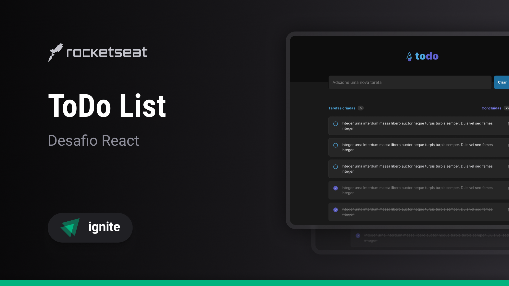

<h1 align="center"> ToDo List </h1>

Programa exclusivo Ignite, promovido pela Rocketseat para ensino de tecnologias WEB.  

  <a href="#-tecnologias">Tecnologias</a>&nbsp;&nbsp;&nbsp;|&nbsp;&nbsp;&nbsp;
  <a href="#-projeto">Projeto</a>&nbsp;&nbsp;&nbsp;|&nbsp;&nbsp;&nbsp;
  <a href="#-layout">Layout</a>&nbsp;&nbsp;&nbsp;|&nbsp;&nbsp;&nbsp;
  <a href="#memo-licença">Licença</a>

  

 

  

## 🚀 Tecnologias

Esse projeto foi desenvolvido com as seguintes tecnologias:

- HTML e CSS
- React
- Vite
- TypeScript
- Git e Github
- Figma

## 💻 Projeto

O ToDo List é uma página web para criação e controle de tarefas. 
Esse projeto é um dos desafios da trilha de React do Ignite, um bootcamp completo de especialização em React, React Native e Node.js. ....

- [Acesse o projeto finalizado, online](https://ignite-todolist-black.vercel.app)

## 🔖 Layout

- [Acesse o Layout do projeto em]([https://ignite-todolist-black.vercel.app](https://www.figma.com/file/FO6WYmutlhnbV74WS2ky1G/ToDo-List-%E2%80%A2-Desafio-React-Copy-Copy?type=design&fuid=840029839436619104))

## :memo: Licença

Esse projeto está sob a licença MIT.

---

Feito com ♥ by Rocketseat :wave: [Participe da nossa comunidade!]()
